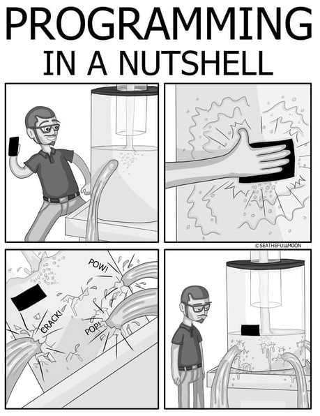

# SweetMeme

-----------------------

## 프로젝트 개요
SweetMeme은 콘텐츠([밈](https://ko.wikipedia.org/wiki/%EC%9D%B8%ED%84%B0%EB%84%B7_%EB%B0%88)) 소비를 위한 플랫폼 서비스입니다.

## 프로젝트 서론
게시판과 페북 or 인스타 사이의 어떠한 콘텐츠 소비 / 킬링타임용 플랫폼이 있으면 좋겠다고 생각해 
방향성을 잡고 공부하고 있던 Spring으로 공부/개발을 병행했습니다.

## 프로젝트 정보
수행 기간: 3개월 ~(서비스 운영 유지보수 중)   
프로젝트 범위: 개인 프로젝트    
내 역할: 프로젝트 전체

## 사용 기술 스택
BuildTool
* gradle

Library
* Spring Boot
* Spring Web MVC
* Spring Data JPA
* H2
* PostgreSQL
* Lombok
* Spring mail
* Spring Boot Devtools
* Thymeleaf

Front
* BootStrap 5
* JQuery

General
* Linux (데비안 10)
* SSL/TLS (Let's Encrypt)

## 프로젝트 이후 성과
Front End
* 콘텐트 요청 부분 전체를 AJAX로 구현해 JQuery에 보다 익숙해졌습니다.

Back End
* 이전에는 해보지 못했던 많은 테이블과 관계를 정의 할 수 있었습니다.
* 자주 조회되는 쿼리는 `@Transient`를 적극 활용해 인메모리 캐싱처럼 사용해 최적화를 했습니다.
* EntityGraph 속성과 fetch join의 실제 쿼리문의 차이는 최적화에 영향을 줄 수 있음을 알았습니다.
* 쿼리 최적화를 통해 N + 1문제를 해결하는 능력을 다졌습니다.

General
* 자동 갱신 SSL/TLS를 적용한 서비스를 리눅스 서버에 배포할 수 있었습니다.  

### 어려웠던 점
Front End
* 재귀적 댓글의 실 구현이 생각보다 까다로웠습니다.

Back End
* 테이블 수가 많아짐에 따라 순환 관계를 만들지 않으며 짜는 등 이전보다 복잡했습니다.

## 프로젝트 설명

### UML

### Main
최신순, 트랜딩, Top 포스트 및 섹션별 포스트를 Async Paging으로 불러온다.   
[관련 코드 바로가기](src/main/java/dev/valium/sweetmeme/module/section)

### Login
Spring Security를 이용한 Login 및 remember-me, Spring mail을 이용한 패스워드 찾기 기능.  
[관련 코드 바로가기](src/main/java/dev/valium/sweetmeme/module/member)

### Sign up
사용자 비밀번호는 BCrypt 암호화 후 저장된다.     
[관련 코드 바로가기](src/main/java/dev/valium/sweetmeme/module/member)

### My Profile
모든 종합항목, 자신의 포스트, 코맨트, 업보트한 포스트를 볼 수 있다.    
[관련 코드 바로가기](src/main/java/dev/valium/sweetmeme/module/post)

### Settings - account
닉네임 및 알림 설정 기능.     
[관련 코드 바로가기](src/main/java/dev/valium/sweetmeme/module/member)

### Settings - profile
아바타, 설명 및 닉네임과 함께 표시될 국가를 고를수 있다.  
[관련 코드 바로가기](src/main/java/dev/valium/sweetmeme/module/member)

### Settings - password
비밀번호 변경 기능.     
[관련 코드 바로가기](src/main/java/dev/valium/sweetmeme/module/member)

### Notification
navbar의 알림 미리보기 및 알림페이지.    
[관련 코드 바로가기](src/main/java/dev/valium/sweetmeme/module/notifications)  

### Upload
포스팅 페이지. mp4외의 Image파일은 webp로 변환한다.         
[관련 코드 바로가기](src/main/java/dev/valium/sweetmeme/module/post)

### Post View
포스트 코맨트, 답글, 업|다운 보트 기능. 코맨트, 답글에 paging 적용.    
[관련 코드 - post](src/main/java/dev/valium/sweetmeme/module/post)   
[관련 코드 - post_tag](src/main/java/dev/valium/sweetmeme/module/post)   
[관련 코드 - post_vote](src/main/java/dev/valium/sweetmeme/module/post)   

### Tag to Search
포스트의 태그를 클릭해 해당태그를 가진 포스트를 검색한다.    
[관련 코드 바로가기](src/main/java/dev/valium/sweetmeme/module/section)

