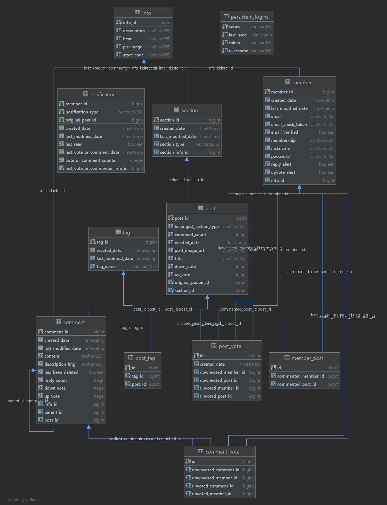

# SweetMeme

쉬는시간 달콤한 밈 한조각 하고가세요!   

-----------------------

## 프로젝트 소개
일반적으로 [밈](https://ko.wikipedia.org/wiki/%EC%9D%B8%ED%84%B0%EB%84%B7_%EB%B0%88) 을 보기위해서는 커뮤니티 자유게시판 등 에서 찾아야하는데,   
이러한 게시판이 특정 커뮤니티에 종속 되지 않고 독립적으로 존재했으면 좋겠다는 생각에서 시작했습니다.     

그리고 게시글의 첫 정보가 제목이 아닌, 컨텐츠 자체가 중심이 되고,    
그것을 계속 뿌려주는 게시판과 페북 or 인스타 사이의 어떠한 컨텐츠 소비 / 킬링타임용 플랫폼이    
있으면 좋겠다 생각해 방향성을 잡고 공부하고있던 Spring으로 공부/개발을 병행했습니다.

## 프로젝트 정보
수행기간: 3개월   
프로젝트 범위: 개인 프로젝트    
내 역할: 프로젝트 전체

## 프로젝트 이후 성과
FrontEnd
* 프론트엔드 코딩을 생각보다 많이해 프론트엔드에 전보다 익숙해졌다.

BackEnd
* 이전에는 해보지 못한 많은 테이블과 관계를 정의 할 수 있었습니다.
* EntityGraph속성과 fetch join의 쿼리문이 다름을 알아내 이것이 이후 최적화에 도움을 줄 수 있음을 알았습니다.
* 쿼리를 보며 쿼리 최적화를 통해 N + 1문제를 해결하는 능력을 다졌습니다.

General
* 컨텐츠 소비 흐름이 끊기지 않게 대부분의 post의 로딩을 비동기로 구현해야 했고 그로인해 프론트 & 백엔드에 추가 적인 공부를 할 수 있었습니다. 

## 어려웠던 점 & 해결방법
### 어려웠던점
FrontEnd
* 댓글 구현 중 대댓글 기능을 재귀적으로 구현해야 했는데, 실제 구현이 생각보다 까다로웠습니다.
* 프론트엔드에 익숙치 않아 상대적으로 많은 시간이 들었습니다.

BackEnd
* 테이블 수가 많아짐에 따라 순환 관계를 만들지 않으며 짜는 등 이전보다 복잡했습니다.

General
* 기능 개발 후 테스트 코드를 짜는것이 기능이 많아질 수록 힘들었습니다.

## 기술 스택
BuildTool
* gradle

Library
* Spring Boot
* Spring Web MVC
* Spring Data JPA
* H2
* PostgreSQL
* Lombok
* Spring mail
* Spring Boot Devtools
* Thymeleaf

Front 
* BootStrap 5
* JQuery

## 프로젝트 설명

### UML

### Main
최신순, 트랜딩, Top 포스트 및 섹션별 포스트를 Async Paging으로 불러온다.   
[관련 코드 바로가기](src/main/java/dev/valium/sweetmeme/module/section)

### Login
Spring Security를 이용한 Login 및 remember-me, Spring mail을 이용한 패스워드 찾기 기능.  
[관련 코드 바로가기](src/main/java/dev/valium/sweetmeme/module/member)

### Sign up
회원가입 기능.    
[관련 코드 바로가기](src/main/java/dev/valium/sweetmeme/module/member)

### My Profile
모든 종합항목, 자신의 포스트, 코맨트, 업보트한 포스트를 볼 수 있다.    
[관련 코드 바로가기](src/main/java/dev/valium/sweetmeme/module/post)

### Settings - account
닉네임 및 알림 설정 기능.     
[관련 코드 바로가기](src/main/java/dev/valium/sweetmeme/module/member)

### Settings - profile
아바타, 설명 및 닉네임과 함께 표시될 국가를 고를 수 있다.  
[관련 코드 바로가기](src/main/java/dev/valium/sweetmeme/module/member)

### Settings - password
비밀번호 변경 기능.     
[관련 코드 바로가기](src/main/java/dev/valium/sweetmeme/module/member)

### Notification
navbar의 알림 미리보기 및 알림페이지.    
[관련 코드 바로가기](src/main/java/dev/valium/sweetmeme/module/notifications)  

### Upload
포스팅 페이지. mp4외의 Image파일은 webp로 변환한다.         
[관련 코드 바로가기](src/main/java/dev/valium/sweetmeme/module/post)

### Post View
포스트 코맨트, 답글, 업|다운 보트 기능. 코맨트, 답글에 paging 적용.    
[관련 코드 - post](src/main/java/dev/valium/sweetmeme/module/post)   
[관련 코드 - post_tag](src/main/java/dev/valium/sweetmeme/module/post)   
[관련 코드 - post_vote](src/main/java/dev/valium/sweetmeme/module/post)   

### Tag to Search
포스트의 태그를 클릭해 해당태그를 가진 포스트를 검색한다.    
[관련 코드 바로가기](src/main/java/dev/valium/sweetmeme/module/section)

